# AIWS Create Knowledge

Turns raw, unstructured Markdown in `knowledge/source/raw/` into **curated, standards-compliant
knowledge entries**. For each raw file it **classifies the content by type**,
**regenerates the Markdown** to match that type's example format and the `knowledge/`
front-matter schema, and **places it in the correct taxonomy folder**. It processes
raw files **strictly one at a time** — never in a batch — so no content or context
is lost during curation.

## When to Use

Trigger phrases: "curate knowledge", "process the raw knowledge", "create knowledge from raw",
"aiws create knowledge", "promote raw notes", "turn this note into a knowledge entry",
"classify and file my knowledge", "clean up knowledge/source/raw"

Use this whenever there are unprocessed notes, pasted docs, transcripts, or draft
Markdown sitting in `knowledge/source/raw/` that need to become proper, discoverable
knowledge entries.

---

## Purpose

`knowledge/source/raw/` is a staging area for unprocessed source material — nothing there
is authoritative and it must not be cited. To become useful, each raw note needs to
be classified, given correct front-matter, reshaped to its type's format, and moved
into the right folder.

Doing this in bulk risks summarizing away detail or merging unrelated notes. This
skill enforces a careful, **one-file-at-a-time** curation flow that preserves the
full content of each source, so the resulting entries are faithful, complete, and
compliant with the `knowledge/` taxonomy.

---

## Core Principles (Non-Negotiable)

1. **One file at a time.** Never batch-process. Fully curate and file one raw file,
   confirm it, and only then move to the next. This preserves per-file context and
   prevents content bleed between unrelated notes.
2. **Preserve content — never lose information.** Reshape and reformat, but do not
   drop facts, steps, numbers, or nuance. When trimming redundancy, keep meaning.
   If unsure whether to cut something, keep it.
3. **Classify before writing.** Determine the correct `type` first; the type dictates
   the folder, the example to follow, and the body structure.
4. **Match the canonical format.** Each type has a defined section shape — the new
   entry must mirror the matching template in **Per-Type Body Templates** below and
   use the front-matter schema.
5. **No fabrication.** Do not invent facts to "complete" an entry. If the raw note is
   missing required metadata (owner, sources), ask the user or use a clear placeholder.
6. **Non-destructive — move, don't delete.** Never delete source files. After an
   entry is curated and confirmed, move the original from `source/raw/` to
   `source/processed/` (see Step 6).

---

## Type Classification Guide

Decide each raw file's `type` from its content, then follow the matching folder
and body shape:

| Signals in the raw content | `type` | Folder | Typical body sections |
|---|---|---|---|
| Explains an idea/term, "what is / how it works" | `concept` | `knowledge/concepts/` | `## Summary`, `## Why It Matters`, `## Key Ideas`, `## Common Pitfalls`, `## See Also` |
| Describes a concrete service/product/system | `system` | `knowledge/systems/` | `## Summary`, responsibilities, interfaces, dependencies |
| A process or decision flow | `workflow` | `knowledge/workflows/` | `## Summary`, steps/stages, decision points |
| A rule, requirement, or governance | `policy` | `knowledge/policies/` | `## Summary`, rules, scope, enforcement |
| Step-by-step task instructions ("how to X") | `how-to` | `knowledge/how-to/` | `## Summary`, `## Prerequisites`, `## Steps`, `## Verification`, `## Rollback`, `## See Also` |
| Lookup material — cheatsheet, table, definitions | `reference` | `knowledge/references/` | `## Summary`, lookup tables/lists |

If a raw file mixes multiple types (e.g., a concept **and** a how-to), tell the
user and propose splitting it into separate entries — do not force one file to be
two types.

**Draft a diagram when it helps.** For `workflow`, `system`, and `concept`
entries, a Mermaid diagram often clarifies the flow or structure. See the **Diagram Patterns** section below (flowchart, sequence, ER, state,
deployment, and C4 — in Mermaid and PlantUML) and embed the relevant diagram in
the entry body.

---

## Front-Matter Schema (every curated entry)

```yaml
---
title: "Human Readable Title"     # Title Case
type: "concept"                    # MUST match the destination folder
owner: "Your Name"
status: "active"                   # active | draft | deprecated
last_updated: "YYYY-MM-DD"         # today's ISO date
tags:                              # lowercase, no spaces; include the type as a tag
  - "topic"
related:                           # optional relative paths from knowledge/
  - "policies/<related-entry>.md"
sources:                           # optional provenance (where the raw came from)
  - "..."
---
```

The body must open with `## Summary`.

---

## Per-Type Body Templates

Each `type` has its **own canonical body structure** — a specialized content
format the curated entry MUST mirror. **These templates are the single source of
truth** for the shape of a knowledge entry: this skill reshapes raw notes to match
them, `aiws-workspace-init` seeds one example per folder from them, and
`aiws-validate-knowledge` checks entries against them. Keep the front-matter schema
above unchanged; only the **body sections** differ per type.

> Preserve all source detail when reshaping. If a raw note has extra material that
> doesn't fit a canonical section, keep it under an extra `##` section rather than
> dropping it — never lose information to fit the template.

### `concept` → `knowledge/concepts/`

````markdown
## Summary

One-paragraph definition of the idea and why it exists.

## Why It Matters

- Bullet the concrete benefits / consequences of the concept.

## Key Ideas

| Term | Meaning |
|---|---|
| ... | ... |

## Simple Example

A short, illustrative snippet (code / HTTP / diagram) — include only if it clarifies.

## Common Pitfalls

- The mistakes people make, and how to avoid them.

## See Also

- `<folder>/<related-entry>.md` — why it's related
````

### `system` → `knowledge/systems/`

````markdown
## Summary

What the system/service is and what it does, in one paragraph.

## At a Glance

| Attribute | Value |
|---|---|
| Owner team | ... |
| Language / framework | ... |
| Datastore | ... |
| Upstream dependency | ... |
| Downstream consumers | ... |
| SLA | ... |

## Responsibilities

- What this system owns and guarantees.

## Non-Responsibilities

- What it explicitly does **not** do (and who does instead).

## High-Level Flow

```
Caller ──▶ This System ──▶ Dependency
```

## Key Endpoints

| Method | Path | Purpose |
|---|---|---|
| ... | ... | ... |

## Operational Notes

- Retries, secrets, runbooks, and cross-links to related entries.
````

### `workflow` → `knowledge/workflows/`

````markdown
## Summary

The process/decision flow this entry describes, in one paragraph.

## Roles

| Role | Responsibility |
|---|---|
| ... | ... |

## Process

1. **Step** — what happens.
2. **Step** — what happens next.

## Decision Matrix

| Condition | Criteria | Action |
|---|---|---|
| ... | ... | ... |

## Decision Flow

```
Trigger ──▶ Decision? ──Yes──▶ Path A
                       └─No───▶ Path B
```

## Exit Criteria

- How you know the process is complete.
````

### `policy` → `knowledge/policies/`

````markdown
## Summary

What the policy governs and the rules it enforces, in one paragraph.

## Scope

Who/what this policy applies to.

## Rules

| # | Rule | Rationale |
|---|---|---|
| P1 | Something **must** / **must not** ... | Why |

## Enforcement

- How the rules are enforced (scanning, reviews, automation, paging).

## Exceptions

- How exceptions are requested, approved, and expired.

## See Also

- `<folder>/<related-entry>.md` — the procedure/system this policy relates to
````

### `how-to` → `knowledge/how-to/`

````markdown
## Summary

The task this guide accomplishes, in one paragraph. Imperative and task-focused.

## Prerequisites

- Access, tools, or preconditions needed before starting.

## Steps

1. **Do this** — with the exact command:
   ```bash
   command --example
   ```
2. **Then this** — next action.

## Verification

- How to confirm the task succeeded.

## Rollback

- How to undo the change if something goes wrong.

## See Also

- `<folder>/<related-entry>.md` — the policy/system this procedure supports
````

### `reference` → `knowledge/references/`

````markdown
## Summary

What this lookup material covers and how to scan it, in one paragraph.

## <Lookup Table Title>

| Key | Name | When to Use |
|---|---|---|
| ... | ... | ... |

## Quick Rules

- Short, scannable rules of thumb for using the reference material.
````

> **Mixed content?** If a raw note fits more than one template (e.g., a concept
> **and** a how-to), do not force one file into one template — split it into
> separate entries, each in its own folder using its own template (see the
> **Splitting a Mixed File** example below).

---

## Instructions

### Step 1 — Locate the Knowledge Root and Raw Files

Find the knowledge root and list raw files awaiting curation:

```bash
# Prefer workspace root; fall back to project/global installs
for r in "knowledge" ".claude/knowledge" "$HOME/.claude/knowledge"; do
  [ -d "$r/source/raw" ] && echo "ROOT: $r" && ls -1 "$r/source/raw"/*.md 2>/dev/null
done
```

Exclude `source/raw/README.md` from the list. If no raw `.md` files exist, report:
> ✅ `knowledge/source/raw/` has no files to curate. Nothing to do.

and stop.

Build the **Raw Queue** — the ordered list of files to process. Tell the user how
many files are queued and that they will be processed **one at a time**.

> **Never** read all raw files and process them together. Handle exactly one entry
> from the queue per cycle (Steps 2–6), then return to pick up the next.

### Step 2 — Read ONE Raw File (Full Content)

Take the next file from the Raw Queue. Read its **entire** content — do not skim or
truncate. Capture every fact, step, table, code block, and caveat. If the file is
large, read it in full via multiple reads; preserve all detail.

### Step 3 — Classify the Content

Using the **Type Classification Guide**, determine the single best `type`. Note:
- The destination folder and the canonical section shape for the type.
- If the content clearly spans multiple types, pause and ask the user whether to
  split it into multiple entries (recommended) before continuing.

State your classification and reasoning to the user in one line.

### Step 4 — Regenerate the Entry to Standard

Produce the curated Markdown:

1. **Front-matter** — fill the schema above. `type` must match the destination
   folder. Set `last_updated` to today's ISO date. Derive `title` (Title Case) and
   `tags` (lowercase, include the type). Carry any provenance into `sources`. If
   `owner` is unknown, ask or use a placeholder (e.g., `"Unknown"`) — do not invent.
2. **Body** — reshape the raw content into the type's canonical sections (see the
   guide). **Preserve all information**: reorganize and clarify, but do not drop
   facts. Keep code blocks, commands, tables, and numbers intact.
3. **Cross-links** — if the content references other knowledge topics, add them to
   `related` (relative paths from `knowledge/`) and/or a `## See Also` section.

Choose a `kebab-case` filename derived from the title
(e.g., "How to Rotate API Keys" → `rotate-api-keys.md`).

### Step 5 — Confirm Placement, Then Write

Show the user the plan for this single file:

```
📄 Curation Plan (file 1 of N)
─────────────────────────────────────────────
Source      : knowledge/source/raw/<raw-file>.md
Classified  : how-to
Destination : knowledge/how-to/<kebab-name>.md
Title       : "How to ..."
Sections     : how-to shape (see the guide above)
─────────────────────────────────────────────
```

Ask:
> **"File this entry as shown? Reply YES to write, or tell me what to change
> (type, title, filename)."**

On **YES**:
- Ensure the destination folder exists (`mkdir -p`).
- **Do not overwrite** an existing entry — if the destination filename exists, ask
  whether to pick a new name or update the existing file.
- Write the curated file to the destination.

### Step 6 — Move the Source to `processed/`

After the curated entry is written and confirmed, move the original source file
from `source/raw/` into `source/processed/` so `source/raw/` only ever holds items
still awaiting curation:

```bash
mkdir -p "<knowledge-root>/source/processed"
mv "<knowledge-root>/source/raw/<raw-file>.md" "<knowledge-root>/source/processed/<raw-file>.md"
```

- **Move, never delete** — the processed source is preserved for provenance.
- If a converted file has a companion original (e.g., a `.pdf` and its `.md`), move
  both into `source/processed/`.

### Step 7 — Loop to the Next File

Return to **Step 2** for the next file in the Raw Queue. Repeat until the queue is
empty. **Do not** start a new file until the current one is fully filed and its raw
source handled.

### Step 8 — Final Report

When the queue is empty, summarize:

```
✅ Knowledge Curation Complete
─────────────────────────────────────────────
Processed : 3 raw file(s), one at a time

Filed:
  ✅ knowledge/how-to/rotate-api-keys.md      (from source/raw/notes-keys.md)
  ✅ knowledge/concepts/rate-limiting.md      (from source/raw/rl-thread.md)
  ✅ knowledge/policies/data-retention.md     (from source/raw/retention.md)

Sources moved to processed/: 3
Next: run aiws-validate-knowledge to confirm compliance.
─────────────────────────────────────────────
```

Suggest running the `aiws-validate-knowledge` skill to confirm the new entries pass.

---

## Examples

### ✅ Good — One-at-a-Time Curation

**Raw queue:** `source/raw/keys.md`, `source/raw/rate-limit.md`

1. Process `source/raw/keys.md` **only**: read fully → classify as `how-to` → regenerate
   with `## Prerequisites / ## Steps / ## Verification / ## Rollback` → plan → YES →
   write `knowledge/how-to/rotate-api-keys.md` → ask about removing raw → next.
2. **Then** process `source/raw/rate-limit.md`: read → classify as `concept` → regenerate
   mirroring the `concept` section shape → write → handle raw.
3. Final report → suggest `aiws-validate-knowledge`.

### ✅ Good — Splitting a Mixed File

**Raw file** contains both an explanation of retries *and* a step-by-step runbook.

- Classify: this is `concept` **and** `how-to`.
- Tell the user: "This file mixes a concept and a how-to. I recommend splitting it
  into `concepts/retries.md` and `how-to/retry-runbook.md`. Proceed?"
- On confirmation, create both — each filed to its own folder, still one at a time.

### ❌ Bad — What This Skill Must NOT Do

> ❌ Reading all raw files at once and emitting several entries in a single pass.

Forbidden — batch processing risks losing or blending content. Always one file per cycle.

> ❌ Summarizing away detail to make the entry "cleaner".

Forbidden — reshape without dropping facts, steps, numbers, or code.

> ❌ Filing an entry whose `type` does not match its folder (e.g., a `how-to` in
> `concepts/`).

Forbidden — `type` must always match the destination folder (see `aiws-validate-knowledge`).

---

## Quick Reference

| Step | Action | Guardrail |
|---|---|---|
| 1 | List raw files, build queue | Exclude `source/raw/README.md` |
| 2 | Read ONE file fully | No skimming/truncation |
| 3 | Classify by type | Split if mixed |
| 4 | Regenerate to standard | Preserve all content |
| 5 | Confirm + write | Don't overwrite existing |
| 6 | Handle raw source | Delete only on confirmation |
| 7 | Loop | One file at a time |
| 8 | Report | Suggest aiws-validate-knowledge |

---

## Diagram Patterns

Use these diagram patterns when producing architecture artifacts. Each pattern
is provided in **both Mermaid and PlantUML** — pick whichever your target
renderer supports, but keep the two representations equivalent (same nodes,
same relationships) if you include both.

> **Choosing a syntax:** Mermaid renders natively in most Markdown viewers
> (GitHub, GitLab, VS Code). PlantUML is preferred when you need richer styling,
> C4 model macros, or integration with existing PlantUML tooling. Wrap PlantUML
> in a ```` ```plantuml ```` fenced block and always include the `@startuml` /
> `@enduml` markers.

---

### 1. System Overview (Flowchart)

Use for showing service boundaries and data flow.

**Mermaid**

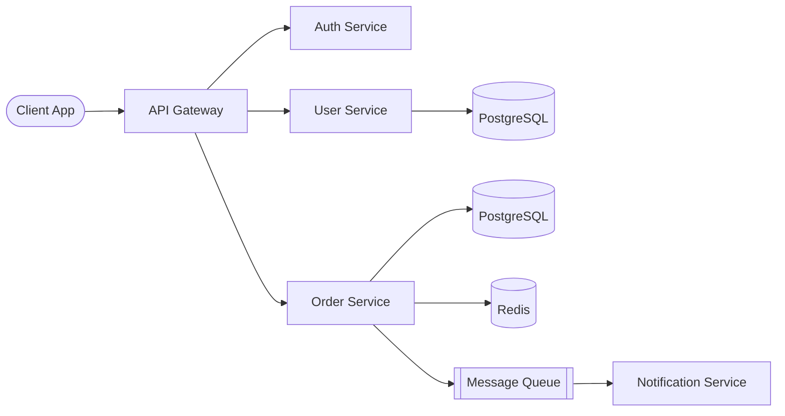

**PlantUML**

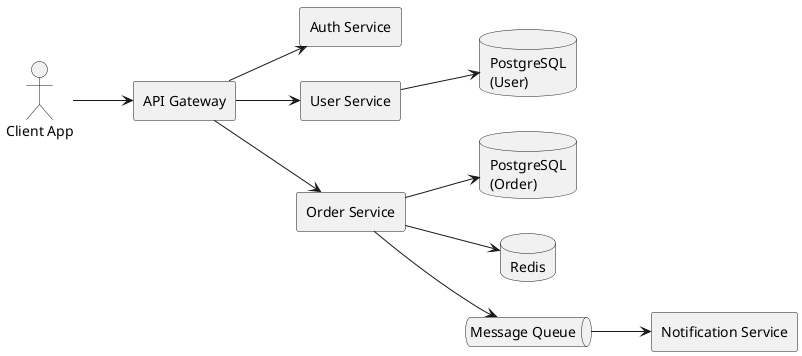

**When to use:** High-level system topology, service maps, deployment views.

---

### 2. Request Flow (Sequence Diagram)

Use for showing step-by-step interactions between components.

**Mermaid**

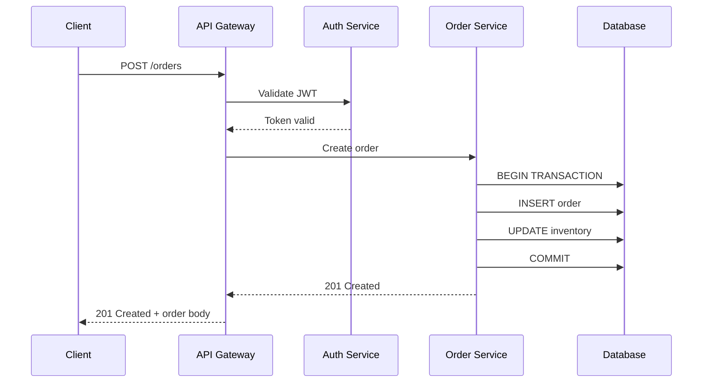

**PlantUML**

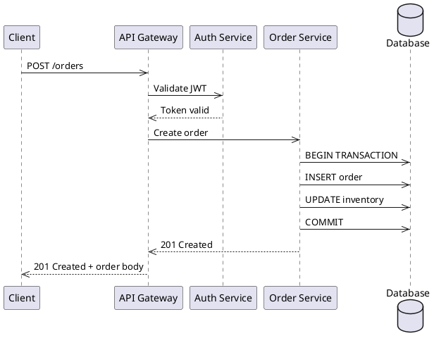

**When to use:** API call flows, auth flows, multi-step processes, debugging
interaction problems.

---

### 3. Entity Relationships (ER Diagram)

Use for database schema visualization.

**Mermaid**

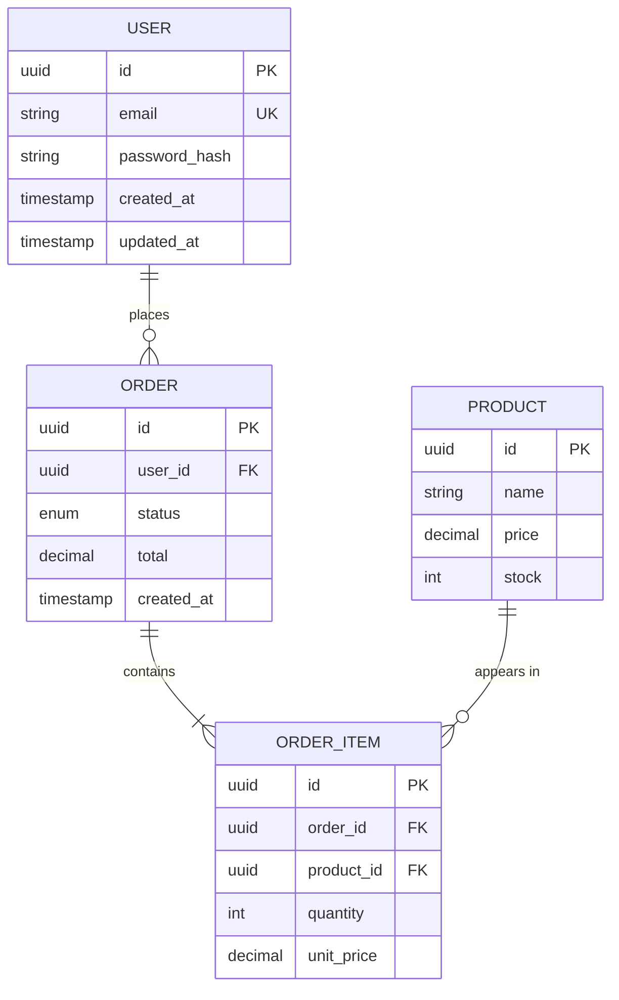

**PlantUML**

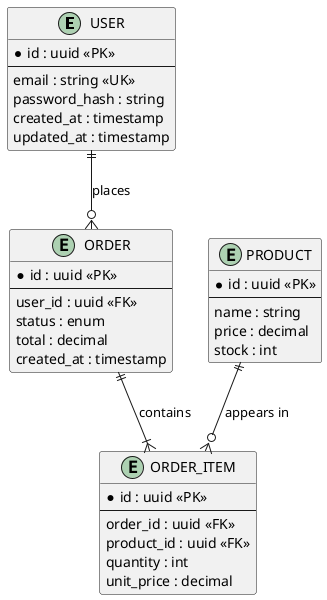

**When to use:** Schema design, migration planning, data model discussions.

---

### 4. State Machine

Use for modeling entity lifecycle.

**Mermaid**

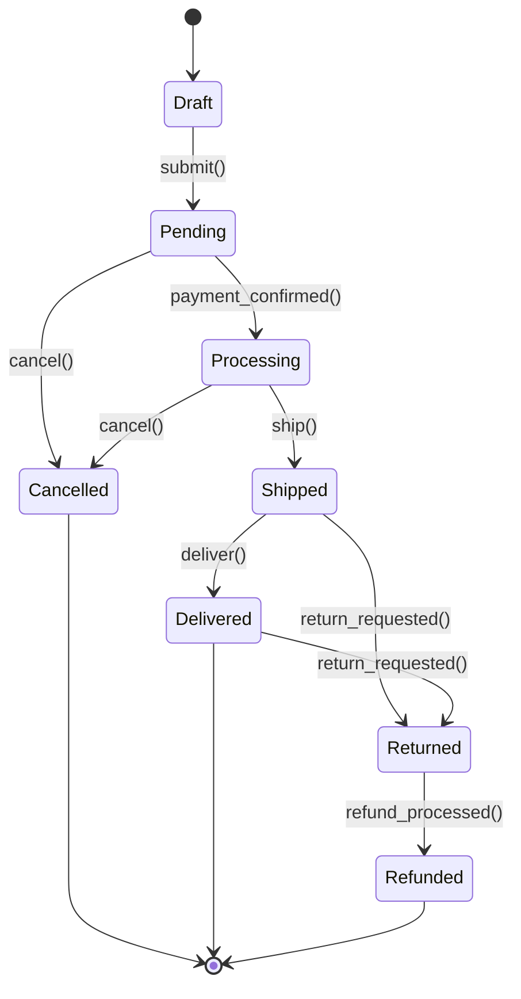

**PlantUML**

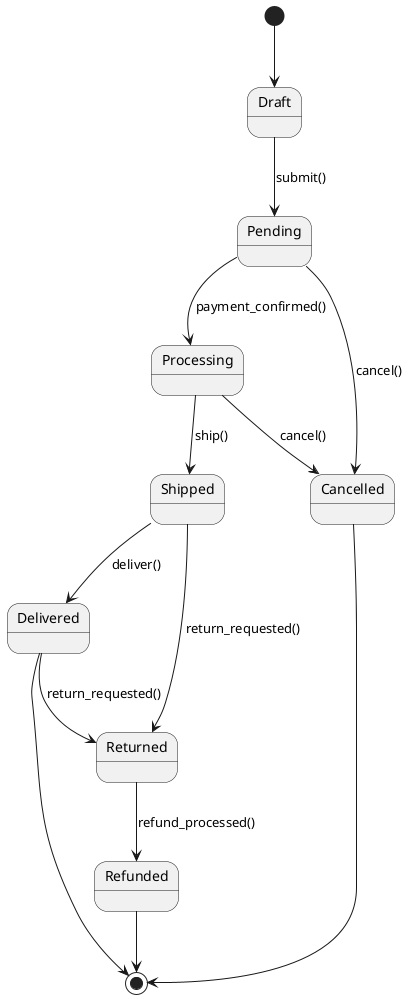

**When to use:** Order workflows, user account states, approval processes,
any entity with a lifecycle.

---

### 5. Deployment / Infrastructure

**Mermaid**

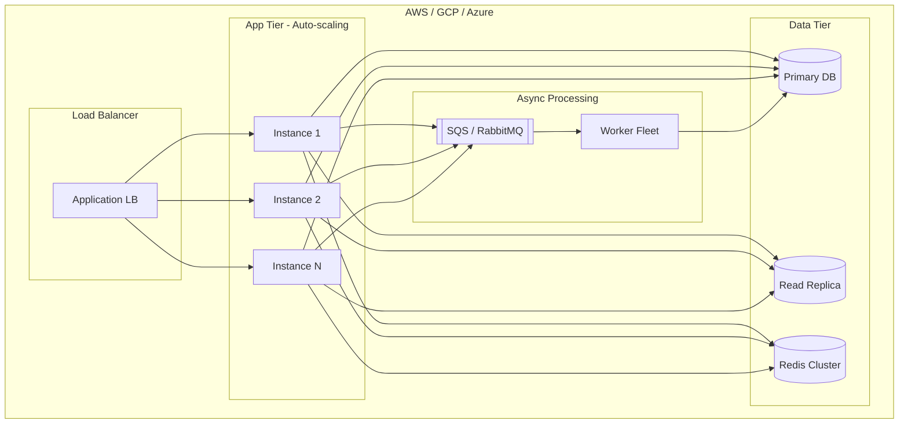

**PlantUML**

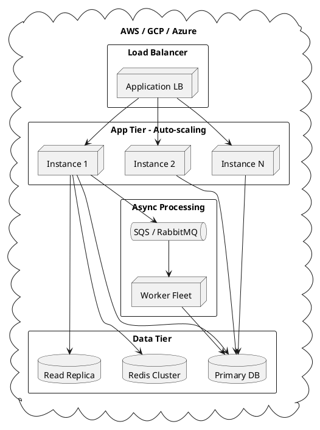

**When to use:** Infrastructure discussions, scaling plans, cloud architecture.

---

### 6. C4 Context Diagram

Use for showing system context and external integrations.

**Mermaid**

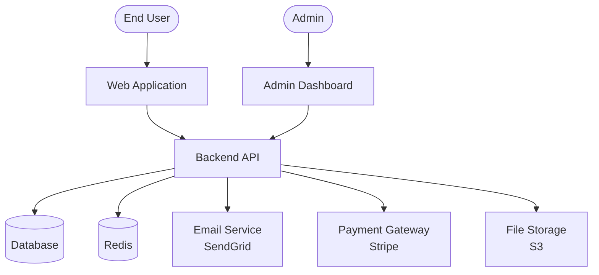

**PlantUML** (using the C4 macro library)

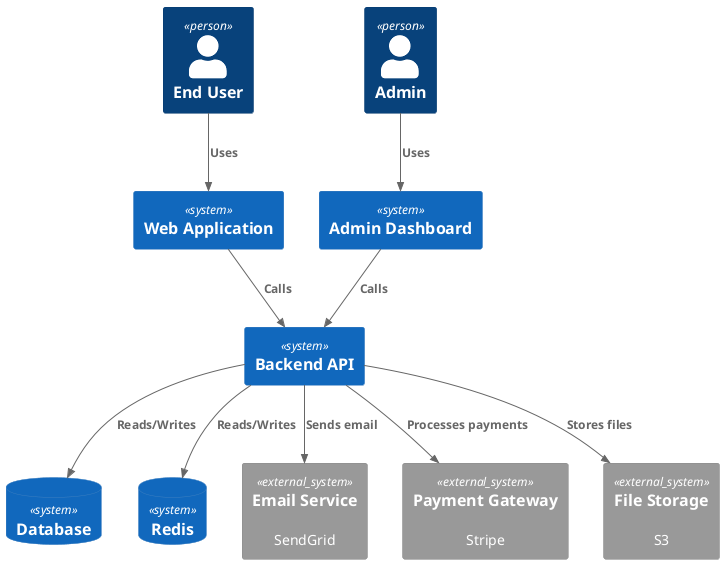

> If the C4 macro library is unavailable, fall back to plain `rectangle` /
> `actor` / `database` elements as in the other PlantUML examples above.

**When to use:** Stakeholder presentations, system boundaries, external
dependency mapping.

---

### Tips

- **Keep both syntaxes equivalent.** If a doc includes both a Mermaid and a
  PlantUML version of the same diagram, they must show the same nodes and edges.
- Keep diagrams focused on ONE concern. Split into multiple diagrams rather
  than cramming everything into one.
- Label arrows with the protocol or action (`HTTP`, `gRPC`, `publish`, `query`).
- Use subgraphs (Mermaid) or nested `rectangle`/`package` (PlantUML) to group
  related components.
- Color-code by concern when helpful:
  - Mermaid: `style NodeName fill:#f96,stroke:#333`
  - PlantUML: `skinparam` blocks or inline `#color` stereotypes.
- Always wrap PlantUML in a ```` ```plantuml ```` fence with `@startuml` /
  `@enduml` markers so it renders correctly.
- For complex systems, start with a C4 Context diagram, then zoom into
  specific areas with flowcharts or sequence diagrams.
---

## References
- The knowledge taxonomy, per-type body structure, and front-matter schema are
  defined inline in this skill (see **Type Classification Guide**,
  **Front-Matter Schema**, and **Per-Type Body Templates**). These are the single
  source of truth that `aiws-workspace-init` seeds from and `aiws-validate-knowledge`
  checks against.
- [Validate Knowledge](../aiws-validate-knowledge/SKILL.md)
- [Ask Knowledge](../aiws-ask-knowledge/SKILL.md)
- [AIWS Create Skill](../aiws-create-skill/SKILL.md)
