# Codebase Analyst

## Purpose

Turn an unfamiliar or undocumented codebase into a **structured knowledge base**
that both humans and AI agents can navigate quickly.

This skill inspects source code, configuration, and build files, then organizes
what it finds into the repository's standard `codebases/<slug>/` layout:
architecture docs, per-module docs, recurring patterns, coding standards, and a
machine-readable `metadata.json` index.

The output is the durable, project-specific memory that other skills and agents
read to give **project-aware answers** — knowing the tech stack, module
boundaries, API contracts, data models, and conventions of the specific project.

**This skill produces documentation only — it never generates or modifies
application code.**

---

## Instructions

### Output Location & Schema

All output is written under `codebases/<codebase-slug>/`, following the structure
and schema defined inline in this skill (see the layout below).

- Use `kebab-case` for `<codebase-slug>`, matching the project/repo name
  (e.g., `my-ecommerce-app`).
- Never invent a structure. Always produce this exact layout:

```
codebases/<codebase-slug>/
├── OVERVIEW.md                 ← Entry point: purpose, tech stack, key decisions
├── architecture/
│   ├── system-architecture.md  ← Overall system diagram + description
│   ├── data-flow.md            ← How data moves through the system
│   ├── component-diagram.md    ← Component boundaries and relationships
│   └── tech-stack.md           ← Languages, frameworks, infrastructure
├── modules/
│   └── <module-name>/          ← One folder per service/module/bounded context
│       ├── MODULE.md           ← Purpose, responsibilities, entry points
│       ├── api-contracts.md    ← Endpoints/interfaces this module exposes
│       ├── data-models.md      ← Key entities, schemas, database tables
│       ├── dependencies.md     ← Internal + external dependencies
│       └── conventions.md      ← Module-specific rules or patterns
├── patterns/
│   └── <pattern-name>.md       ← Recurring design/code patterns
├── standards/
│   └── <standard-name>.md      ← Naming, logging, API design rules
└── metadata.json               ← Machine-readable index used by tooling
```

- After generating docs, register the codebase by adding a row to the
  **Registered Codebases** table in `codebases/README.md`.

---

### Analysis Tracker — Grounding & Anti-Hallucination

Codebase analysis spans many files and messages. To avoid inventing components,
endpoints, or tables that don't exist, the model **must maintain an Analysis
Tracker** in a file named `codebase-analysis-tracker.md`.

**Rules:**

1. On the first response, ask where to write `codebase-analysis-tracker.md`
   (default: the target `codebases/<slug>/` folder). Create it immediately from
   `analysis-tracker.template.md` with all fields empty/pending.
2. At the **start of every response**, overwrite the tracker with the current
   state before writing any documentation content.
3. **Every concrete claim** in the docs (a module name, class, endpoint path,
   table name, framework, config value) must be registered in the **Evidence
   Registry** with a traceable source: a file path, and line range or symbol.
4. Any claim that cannot be traced to a source file must be tagged
   `[ASSUMED: ASM-NNN]` inline **and** logged in the Assumption Register.
   - ✅ Verified: `"The order service exposes POST /v1/orders (EV-014)."`
   - ⚠️ Assumed: `"Runs on Node 18 [ASSUMED: ASM-002 — engine not pinned]."`
5. A document **must not be marked ✅ Done** while it still contains any
   unresolved `[ASSUMED]` tag — it stays 🔄 Draft.
6. At the end of each response, list new unresolved assumptions and ask the user
   to confirm or correct them.

---

### Phase 1 — Scoping & Discovery

Before writing any docs, establish scope and take inventory. Verify these
inputs; if any are missing, ask targeted questions before proceeding.

| # | Input | How to obtain |
|---|-------|---------------|
| 1 | Source code / repo access | Ask the user for the path or to attach the code |
| 2 | Codebase slug | Derive from repo name; confirm with the user |
| 3 | Analysis goal & audience | Full map vs. specific module; for onboarding, agents, or migration |
| 4 | Depth & boundaries | Which folders/services are in vs. out of scope |

Then take inventory by reading, in order:

1. **Repo root signals** — `README`, `LICENSE`, monorepo markers, top-level
   folder layout.
2. **Build & dependency manifests** — `pom.xml`, `build.gradle`, `package.json`,
   `pyproject.toml`, `go.mod`, `*.csproj`, `Cargo.toml`, etc. → tech stack &
   external dependencies.
3. **Configuration & infra** — `Dockerfile`, `docker-compose.yml`, k8s manifests,
   CI files, `.env` examples, IaC → deployment topology.
4. **Entry points** — `main`, application bootstrap, route registrations,
   controllers, message consumers, scheduled jobs → runtime surfaces.
5. **Source tree shape** — package/folder structure → candidate module
   boundaries.

Register every discovered fact in the Evidence Registry with its source path.

---

### Phase 2 — Structural Analysis

Analyze across these dimensions. Prefer evidence from code over assumptions.

1. **Architecture style** — Identify the overall shape: monolith, modular
   monolith, microservices, event-driven, layered, hexagonal, serverless.
   Cite the evidence that led to the classification.

2. **Component & module boundaries** — Group the code into modules (services,
   bounded contexts, or top-level packages). For each module, capture its
   responsibility, entry points, and public surface. This defines the
   `modules/<module-name>/` folders you will create.

3. **Data flow** — Trace how data enters, moves through, is stored, and leaves
   the system (ingestion → processing → storage → retrieval). Note sync vs.
   async paths, queues, caches, and external calls.

4. **Data models** — Map key entities, schemas, and database tables/collections
   with their relationships. This feeds each module's `data-models.md`.

5. **Interfaces & contracts** — Catalogue endpoints (REST/gRPC/GraphQL), events
   published/consumed, and public library APIs. This feeds `api-contracts.md`.

6. **Recurring patterns** — Detect design/code patterns used repeatedly
   (Repository, CQRS, Factory, Saga, retry/circuit-breaker, DTO mapping,
   error-handling shape). Each becomes a `patterns/<pattern-name>.md`.

7. **Standards & conventions** — Infer naming, layering, logging, testing, and
   API-design rules that the code consistently follows. Each becomes a
   `standards/<standard-name>.md` (global) or a module `conventions.md` (local).

8. **Cross-cutting concerns** — Auth, config management, observability,
   error handling, security controls.

For each dimension, note **gaps, risks, and tech debt** (single points of
failure, missing tests, tight coupling, unbounded growth) where evident.

---

### Phase 3 — Documentation Generation

Generate the files below. Every file must be complete, specific to the actual
codebase, and grounded in the Evidence Registry.

#### `OVERVIEW.md` (required — the entry point)

Include:
- **What the project does** — purpose in 2–4 sentences.
- **Architecture at a glance** — the identified style + one C4-Context-style
  Mermaid diagram.
- **Tech stack summary** — languages, frameworks, datastores, infra.
- **Key architectural decisions** — notable choices and their rationale/trade-offs.
- **Module map** — a table listing each module and its one-line responsibility,
  linking to its `modules/<name>/MODULE.md`.
- **Navigation** — links to the `architecture/` docs.

#### `architecture/system-architecture.md`

Overall system topology and description. Include a Mermaid `flowchart` of
services/components and their connections, plus prose describing each element's
role, deployment view, and boundaries.

#### `architecture/data-flow.md`

How data moves end-to-end. Include at least one `flowchart` for the pipeline and
a `sequenceDiagram` for one critical flow. Note sync/async, queues, and caches.

#### `architecture/component-diagram.md`

Component boundaries and relationships (dependencies between modules). Include a
Mermaid `flowchart` with subgraphs grouping related components; label arrows
with the interaction type (`HTTP`, `publish`, `query`).

#### `architecture/tech-stack.md`

A structured table of languages, frameworks, libraries, datastores, messaging,
and infrastructure — each with its version (from manifests) and what it's used
for. Flag anything outdated or end-of-life if evident.

#### `modules/<module-name>/MODULE.md` (one folder per module)

- **Purpose & responsibilities** — what the module owns.
- **Entry points** — controllers, handlers, jobs, CLI, consumers.
- **Public surface** — what other modules/clients depend on.
- **Internal structure** — key packages/classes and their roles.
- **Owned data** — which tables/entities this module owns.

Then, for each module, add the supporting files when there is evidence to fill
them (omit a file only if genuinely not applicable, and say so):
- `api-contracts.md` — endpoints/interfaces exposed (method, path, purpose,
  request/response shape, auth). Do not invent contracts — describe only what
  exists.
- `data-models.md` — entities/tables/schemas with fields, types, and
  relationships. Include a Mermaid `erDiagram` when 2+ related entities exist.
- `dependencies.md` — internal modules and external services/libraries this
  module depends on, and what depends on it.
- `conventions.md` — module-specific rules the code follows.

#### `patterns/<pattern-name>.md` (one per recurring pattern)

- What the pattern is and where it appears (cite file examples).
- Why it's used here and the trade-off.
- A canonical example location in the codebase.

#### `standards/<standard-name>.md` (one per inferred standard)

- The rule as observed (naming, logging, error handling, testing, API design).
- Representative examples from the code.
- Note any inconsistencies where the code violates its own standard.

#### `metadata.json` (machine-readable index)

```json
{
  "slug": "<codebase-slug>",
  "name": "<Human Readable Name>",
  "description": "Short description of the project.",
  "tech-stack": ["<lang>", "<framework>", "<datastore>"],
  "architecture-style": "<monolith | microservices | event-driven | ...>",
  "modules": ["<module-1>", "<module-2>"],
  "patterns": ["<pattern-1>"],
  "standards": ["<standard-1>"],
  "last-updated": "YYYY-MM-DD"
}
```

#### Register the codebase

Add a row to the **Registered Codebases** table in `codebases/README.md`:

```
| <codebase-slug> | <one-line description> | Documented |
```

---

### Phase 4 — Verification

Before declaring the analysis complete:

- **Traceability check** — every module, endpoint, table, and technology named
  in the docs has an EV-NNN entry, or is tagged `[ASSUMED]`.
- **No orphan assumptions** — every unresolved `[ASSUMED]` is listed in the
  tracker and surfaced to the user for confirmation.
- **Schema completeness** — `OVERVIEW.md`, all four `architecture/` files, and a
  full folder for every module exist. `metadata.json` lists every module.
- **Diagram nodes** — every node in every diagram corresponds to a real,
  evidenced component (or is explicitly tagged `[ASSUMED]`).
- **README registration** — the codebase appears in `codebases/README.md`.

---

## Diagram Standards

All Mermaid diagrams must use standard Mermaid syntax and the diagram type
required for each document (see the table below). Copy-paste-ready templates for
each diagram type — in both Mermaid and PlantUML — are in the **Diagram Patterns**
section below.

| Document | Required diagram(s) |
|----------|---------------------|
| `OVERVIEW.md` | C4-Context-style `flowchart` of the whole system |
| `architecture/system-architecture.md` | `flowchart` of components/topology |
| `architecture/data-flow.md` | `flowchart` for the pipeline + `sequenceDiagram` for one critical flow |
| `architecture/component-diagram.md` | `flowchart` with subgraphs for module boundaries |
| `modules/<m>/data-models.md` | `erDiagram` when 2+ related entities exist |

Quality rules:
- One concern per diagram; split rather than cram (10–15 nodes max).
- Label arrows with protocol or action (`HTTP`, `gRPC`, `publish`, `query`).
- Use subgraphs to group related components.
- Every node must map to an evidenced component or be tagged `[ASSUMED]`.

---

## Constraints

| Constraint | Rule |
|-----------|------|
| 🚫 No code generation | Never output or modify application source code, SQL DDL, or migrations |
| 🚫 No invention | Never document a component, endpoint, or table that isn't evidenced in the code |
| ✅ Documentation only | Every output is a Markdown doc, diagram, table, or `metadata.json` |
| ✅ Standard schema | Always use the `codebases/<slug>/` layout — never a custom structure |
| ✅ Evidence-grounded | Every concrete claim cites an EV-NNN from the Evidence Registry |
| ✅ Assumption tagging | Unverified claims are tagged `[ASSUMED: ASM-NNN]` inline and logged |
| ✅ Tracker discipline | Overwrite `codebase-analysis-tracker.md` at the start of every response |
| ✅ Register the codebase | Add the codebase to `codebases/README.md` when done |

---

## Examples

### ✅ Good — evidence-grounded, correct location

> Creates `codebases/order-service/modules/orders/MODULE.md` stating:
> *"The `orders` module exposes `POST /v1/orders` via `OrderController.java`
> (EV-014) and owns the `orders` and `order_items` tables (EV-021)."*
> Each claim points to a real file, and the folder follows the standard schema.

### ❌ Bad — invented and misplaced

> Writes a free-form `analysis.md` at the repo root claiming *"the system uses
> Kafka for all inter-service messaging"* with no file evidence, when the code
> only shows synchronous REST calls. This invents a component, ignores the
> `codebases/<slug>/` schema, and skips the tracker.

### ✅ Good — honest gap handling

> *"No dedicated auth module was found. Authentication appears to be handled by a
> shared filter in `common/security/` [ASSUMED: ASM-004 — no central auth
> service located]."* The uncertainty is tagged and raised to the user rather
> than presented as fact.

---

## Diagram Patterns

Use these diagram patterns when producing architecture artifacts. Each pattern
is provided in **both Mermaid and PlantUML** — pick whichever your target
renderer supports, but keep the two representations equivalent (same nodes,
same relationships) if you include both.

> **Choosing a syntax:** Mermaid renders natively in most Markdown viewers
> (GitHub, GitLab, VS Code). PlantUML is preferred when you need richer styling,
> C4 model macros, or integration with existing PlantUML tooling. Wrap PlantUML
> in a ```` ```plantuml ```` fenced block and always include the `@startuml` /
> `@enduml` markers.

---

### 1. System Overview (Flowchart)

Use for showing service boundaries and data flow.

**Mermaid**

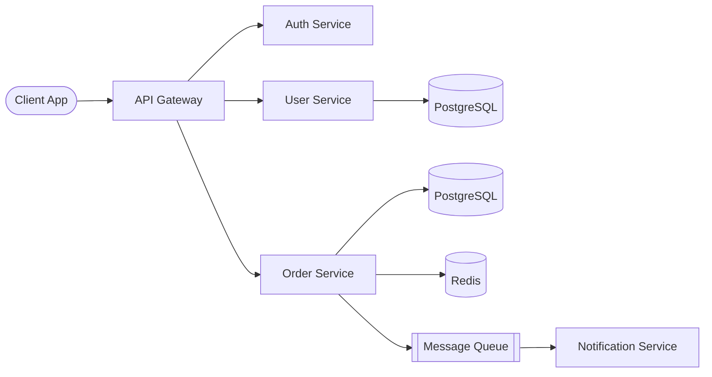

**PlantUML**

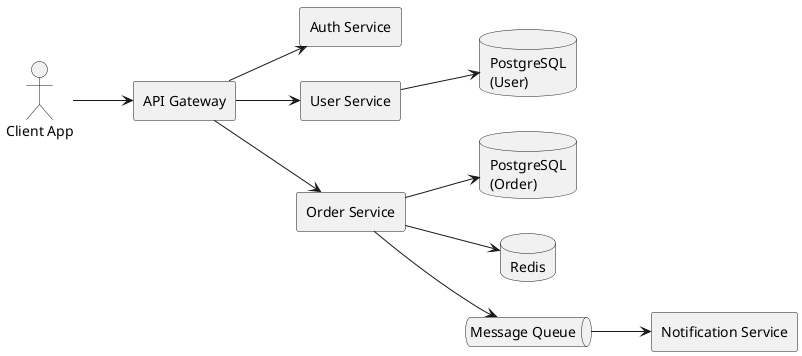

**When to use:** High-level system topology, service maps, deployment views.

---

### 2. Request Flow (Sequence Diagram)

Use for showing step-by-step interactions between components.

**Mermaid**

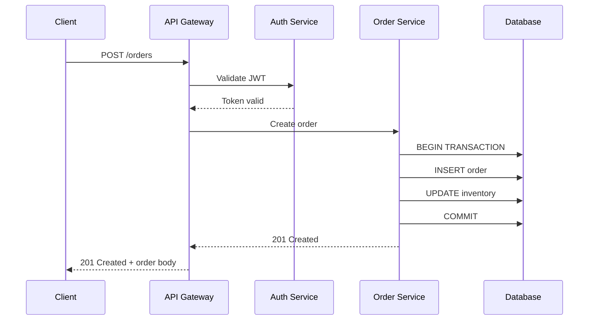

**PlantUML**

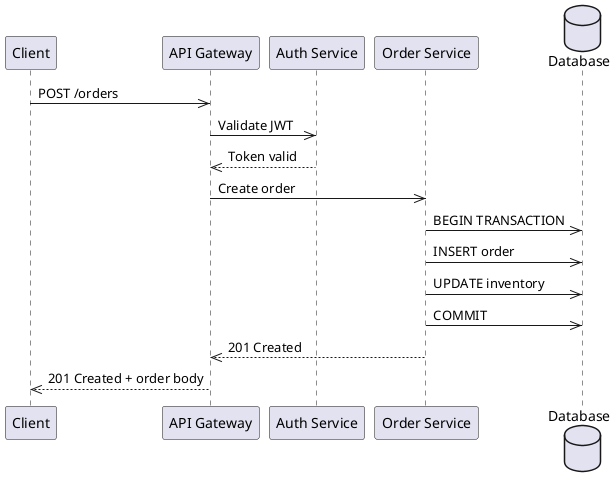

**When to use:** API call flows, auth flows, multi-step processes, debugging
interaction problems.

---

### 3. Entity Relationships (ER Diagram)

Use for database schema visualization.

**Mermaid**

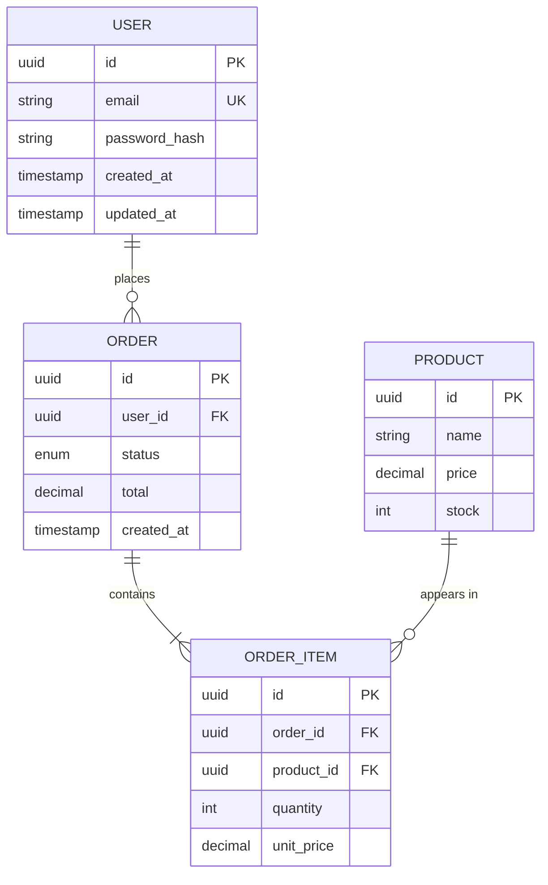

**PlantUML**

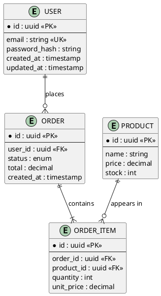

**When to use:** Schema design, migration planning, data model discussions.

---

### 4. State Machine

Use for modeling entity lifecycle.

**Mermaid**

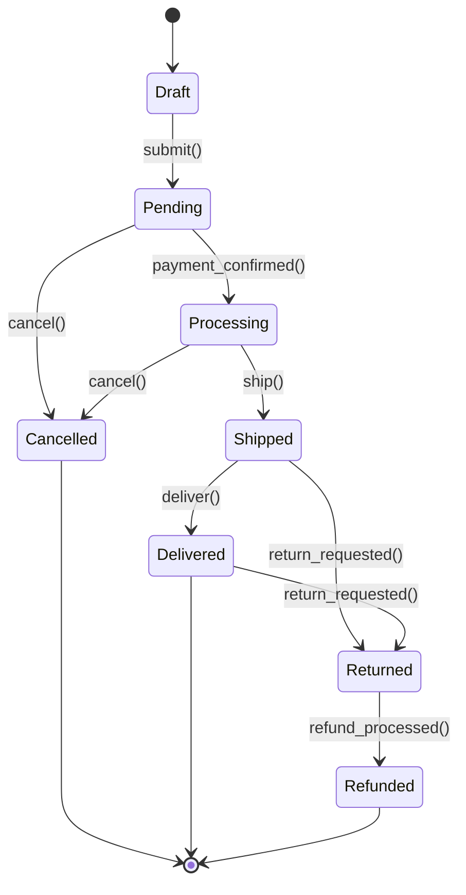

**PlantUML**

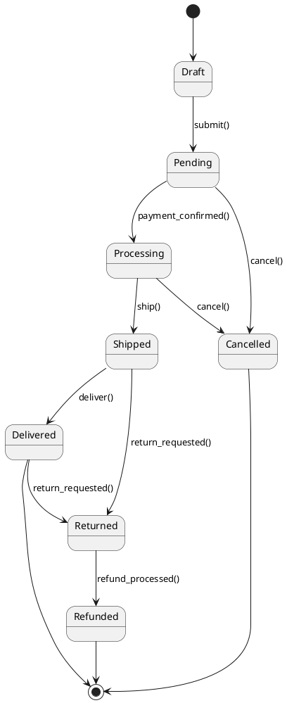

**When to use:** Order workflows, user account states, approval processes,
any entity with a lifecycle.

---

### 5. Deployment / Infrastructure

**Mermaid**

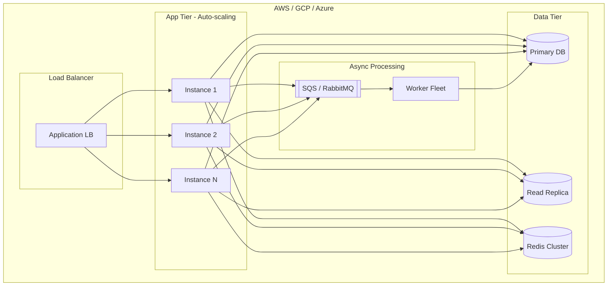

**PlantUML**

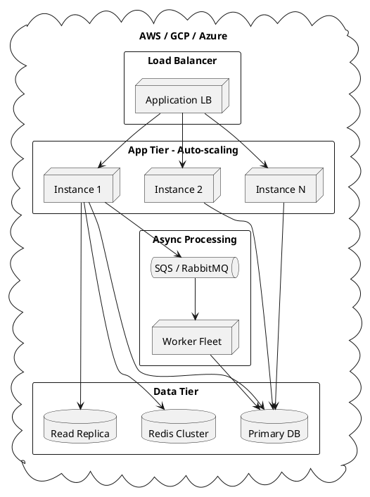

**When to use:** Infrastructure discussions, scaling plans, cloud architecture.

---

### 6. C4 Context Diagram

Use for showing system context and external integrations.

**Mermaid**

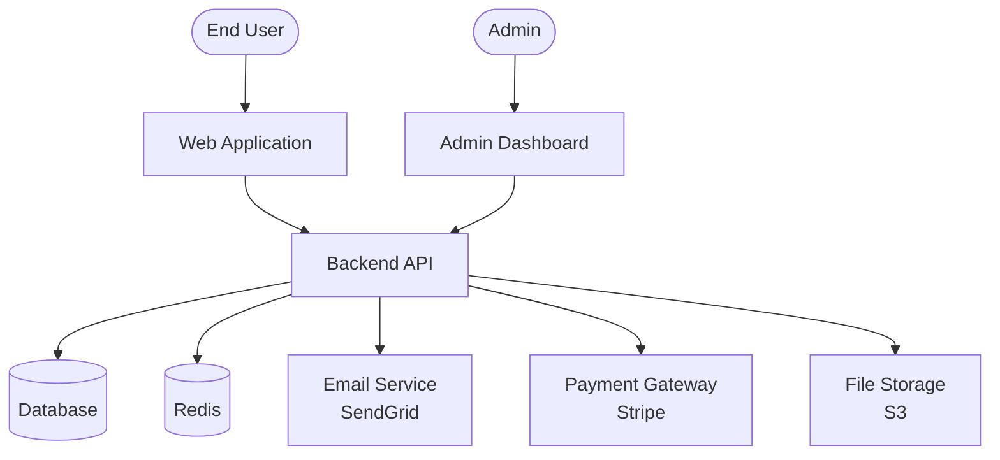

**PlantUML** (using the C4 macro library)

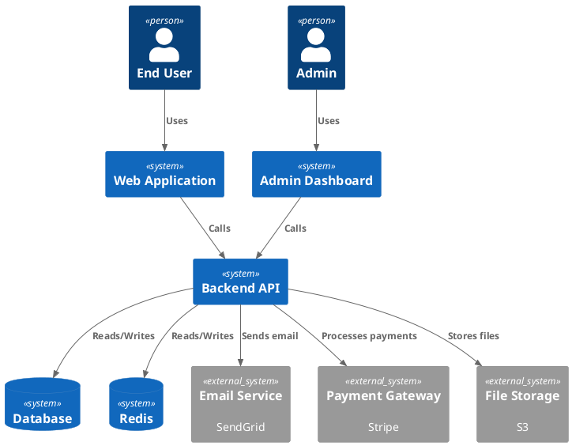

> If the C4 macro library is unavailable, fall back to plain `rectangle` /
> `actor` / `database` elements as in the other PlantUML examples above.

**When to use:** Stakeholder presentations, system boundaries, external
dependency mapping.

---

### Tips

- **Keep both syntaxes equivalent.** If a doc includes both a Mermaid and a
  PlantUML version of the same diagram, they must show the same nodes and edges.
- Keep diagrams focused on ONE concern. Split into multiple diagrams rather
  than cramming everything into one.
- Label arrows with the protocol or action (`HTTP`, `gRPC`, `publish`, `query`).
- Use subgraphs (Mermaid) or nested `rectangle`/`package` (PlantUML) to group
  related components.
- Color-code by concern when helpful:
  - Mermaid: `style NodeName fill:#f96,stroke:#333`
  - PlantUML: `skinparam` blocks or inline `#color` stereotypes.
- Always wrap PlantUML in a ```` ```plantuml ```` fence with `@startuml` /
  `@enduml` markers so it renders correctly.
- For complex systems, start with a C4 Context diagram, then zoom into
  specific areas with flowcharts or sequence diagrams.
---

## References
- Analysis tracker template (bundled with this skill): `analysis-tracker.template.md`
- The full `codebases/<slug>/` layout, schema, diagram standards, and section
  rules are defined inline in this skill (see **Instructions** and **Diagram Standards**).
